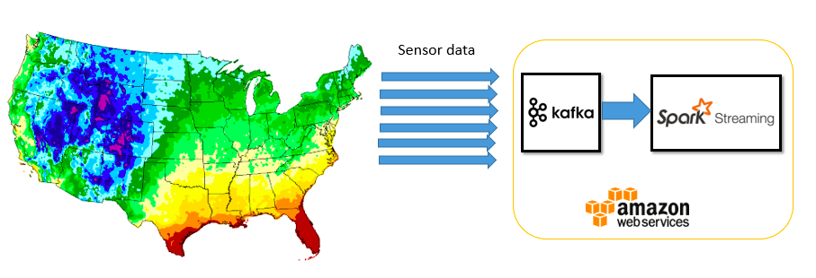

IoT: Real-time Data Processing and Analytics using Apache Spark / Kafka
=============================================

  

## Table of Contents
1. [Overview](#1-overview)
2. [Format of sensor data](#2-format-of-sensor-data) 
3. [Analysis of data](#3-analysis-of-data)
4. [Results](#4-results)

## 1. Overview

##### Use case
- Analyzing U.S nationwide temperature from IoT sensors in real-time

##### Project Scenario:
- Multiple temperature sensors are deployed in each U.S state
- Each sensor regularly sends temperature data to a Kafka server in AWS Cloud (Simulated by feeding 10,000 JSON data by using kafka-console-producer)
- Kafka client retrieves the streaming data every 3 seconds
- PySpark processes and analizes them in real-time by using Spark Streming, and show the results

##### Key Technologies:
- Apache Spark (Spark Streaming)
- Apache Kafka
- Python/PySpark

## 2. Format of sensor data

I used the simulated data for this project. ```iotsimulator.py``` generates JSON data as below format.

```
<Example>

{
    "guid": "0-ZZZ12345678-08K",
    "destination": "0-AAA12345678",
    "state": "CA", 
    "eventTime": "2016-11-16T13:26:39.447974Z", 
    "payload": {
        "format": "urn:example:sensor:temp", 
        "data":{
            "temperature": 59.7
        }
    }
}
```


Field | Description
---   | ---
guid | A global unique identifier which is associated with a sensor.   
destination | An identifier of the destination which sensors send data to (One single fixed ID is used in this project)
state | A randomly chosen U.S state. A same guid always has a same state
eventTime | A timestamp that the data is generated
format | A format of data
temperature | Calculated by continuously adding a random number (between -1.0 to 1.0) to each state's average annual temperature everytime when the data is generated.  https://www.currentresults.com/Weather/US/average-annual-state-temperatures.php


If you need to generate 10,000 sensors data:

```
$ ./iotsimulator.py 10000 > testdata.txt
```

## 3. Analysis of data
In this project, I achieved 4 types of real-time analysis. 
- Average temperature by each state (Values sorted in descending order)
- Total messages processed
- Number of sensors by each state (Keys sorted in ascending order)
- Total number of sensors

#### (1) Average temperature by each state (Values sorted in descending order)

```python
avgTempByState = jsonRDD.map(lambda x: (x['state'], (x['payload']['data']['temperature'], 1))) \
                 .reduceByKey(lambda x,y: (x[0]+y[0], x[1]+y[1])) \
                 .map(lambda x: (x[0], x[1][0]/x[1][1])) 
sortedTemp = avgTempByState.transform(lambda x: x.sortBy(lambda y: y[1], False))
```

- In the first ```.map``` operation, PySpark creates pair RDDs (k, v) where _k_ is a values of a fileld ```state```, and _v_ is a value of a field ```temperature``` with a count of 1

```
<Example>

('StateA', (50.0, 1))
('StateB', (20.0, 1))
('StateB', (21.0, 1))
('StateC', (70.0, 1))
('StateA', (52.0, 1))
('StateB', (22.0, 1))
...
```

- In the next ```.reduceByKey``` operation, PySpark aggregates the values by a same key and reduce them to a single entry  

```
<Example>

('StateA', (102.0, 2))  
('StateB', (63.0, 3))  
('StateC', (70.0, 1))  
...
```

- In the next ```.map``` operation, PySpark calculates the average temperature by deviding the sum of ```temperature``` by the total count  

```
<Example>

('StateA', 51.0)
('StateB', 21.0)
('StateC', 70.0)
...
```

- Finally, PySpark sorts the value of average temperature in descending order  

```
<Example>

('StateC', 70.0)
('StateA', 51.0)
('StateB', 21.0)
...
```


#### (2) Total messages processed

```python
messageCount = jsonRDD.map(lambda x: 1) \
                     .reduce(add) \
                     .map(lambda x: "Total count of messages: "+ unicode(x))
```

- Simply appends a count 1 to each entry, and then sums them up


#### (3) Number of sensors by each state (Keys sorted in ascending order)

```python
numSensorsByState = jsonRDD.map(lambda x: (x['state'] + ":" + x['guid'], 1)) \
                        .reduceByKey(lambda a,b: a*b) \
                        .map(lambda x: (re.sub(r":.*", "", x[0]), x[1])) \
                        .reduceByKey(lambda a,b: a+b)
sortedSensorCount = numSensorsByState.transform(lambda x: x.sortBy(lambda y: y[0], True))
```

- In the first ```.map``` operation, PySpark creates pair RDDs (k, v) where _k_ is a value of fields ```state``` and ```guid``` concatenated with  ":", and _v_ is a value of count 1  

```
<Example>

('StateB:0-ZZZ12345678-28F', 1)
('StateB:0-ZZZ12345678-30P', 1)
('StateA:0-ZZZ12345678-08K', 1)
('StateC:0-ZZZ12345678-60F', 1)
('StateA:0-ZZZ12345678-08K', 1)
('StateB:0-ZZZ12345678-30P', 1)
...
```

- In the next ```.reduceByKey``` operation, PySpark aggregates the values by a same key and reduce them to a single entry but the values stay 1  

```
('StateB:0-ZZZ12345678-28F', 1)
('StateB:0-ZZZ12345678-30P', 1)
('StateA:0-ZZZ12345678-08K', 1)
('StateC:0-ZZZ12345678-60F', 1)
...
```

- In the next ```.map``` operation, PySpark removes characters of ":" and guid

```
<Example>

('StateB', 1)
('StateB', 1)
('StateA', 1)
('StateC', 1)
...
```

- In the last ```.reduceByKey``` operation, PySpark aggregates the values by a same key and reduce them to a single entry  

```
<Example>

('StateB', 2)
('StateA', 1)
('StateC', 1)
...
```

- Finally, PySpark sorts the values in ascending order  

```
<Example>

('StateA', 1)
('StateB', 2)
('StateC', 1)
...
```


####(4) Total number of sensors

```python
sensorCount = jsonRDD.map(lambda x: (x['guid'], 1)) \
                     .reduceByKey(lambda a,b: a*b) \
                     .reduce(add) \
                     .map(lambda x: "Total count of sensors: " + unicode(x))
```

- In the first ```.map``` operation, PySpark creates pair RDDs (k, v) where _k_ is a value of a field ```guid```, and _v_ is a count of 1

```
<Example>

('0-ZZZ12345678-08K', 1)
('0-ZZZ12345678-28F', 1)
('0-ZZZ12345678-30P', 1)
('0-ZZZ12345678-60F', 1)
('0-ZZZ12345678-08K', 1)
('0-ZZZ12345678-30P', 1)
...
```

- In the next ```.reduceByKey``` operation, PySpark aggregates the values by a same key and reduce them to a single entry but the values stay 1  

```
<Example>

('0-ZZZ12345678-08K', 1)
('0-ZZZ12345678-28F', 1)
('0-ZZZ12345678-30P', 1)
('0-ZZZ12345678-60F', 1)
...
```

- In the next ```.reduce``` operation, PySpark sums up all values


## 4. Results

The result shows console output of Spark Streaming which processed and analyzed 10,000 sensor data in real-time.

```
[ec2-user@ip-172-31-9-184 ~]$ spark-submit --jars spark-streaming-kafka-0-8-assembly_2.11-2.0.0-preview.jar  \ 
./kafka-direct-iotmsg.py localhost:9092 iotmsgs

<snip>

-------------------------------------------
Time: 2016-11-21 13:30:06
-------------------------------------------

-------------------------------------------
Time: 2016-11-21 13:30:06
-------------------------------------------

-------------------------------------------
Time: 2016-11-21 13:30:06
-------------------------------------------

-------------------------------------------
Time: 2016-11-21 13:30:06
-------------------------------------------

-------------------------------------------
Time: 2016-11-21 13:30:09       <- Average temperature by each state (Values sorted in descending order)
-------------------------------------------
(u'FL', 70.70635838150288)
(u'HI', 70.59879999999998)
(u'LA', 67.0132911392405)
(u'TX', 64.63165467625899)
(u'GA', 64.22095808383233)
(u'AL', 63.29540229885056)
(u'MS', 62.92658730158729)
(u'SC', 62.889361702127644)
(u'AZ', 61.161951219512204)
(u'AR', 60.006074766355134)
(u'CA', 59.56944444444444)
(u'NC', 59.13968253968251)
(u'OK', 59.10108108108111)
(u'DC', 57.916810344827596)
(u'TN', 57.18434782608696)
(u'KY', 56.375510204081664)
(u'DE', 54.6767634854772)
(u'VA', 54.5506726457399)
(u'MD', 54.30196078431374)
(u'KS', 53.60306748466258)
(u'MO', 53.59634146341466)
(u'NM', 53.55384615384617)
(u'NJ', 52.90479452054793)
(u'IN', 52.55497382198954)
(u'IL', 51.9223958333333)
(u'WV', 51.89952380952379)
(u'OH', 50.52346368715085)
(u'NV', 50.38380281690144)
(u'RI', 49.90240963855423)
(u'PA', 49.61223404255321)
(u'UT', 49.00546448087432)
(u'CT', 48.47242990654204)
(u'NE', 47.96193548387097)
(u'OR', 47.908675799086716)
(u'WA', 47.88577777777777)
(u'MA', 47.81961722488036)
(u'IA', 47.54875621890548)
(u'SD', 45.449999999999996)
(u'CO', 45.16935483870966)
(u'NY', 44.81830985915495)
(u'MI', 44.58102564102565)
(u'ID', 44.56483050847461)
(u'NH', 43.39304347826085)
(u'MT', 43.05155709342561)
(u'WY', 42.9689655172414)
(u'VT', 42.668322981366465)
(u'WI', 41.81523809523809)
(u'ME', 41.695061728395046)
(u'MN', 40.348076923076924)
(u'ND', 40.23502538071064)
(u'AK', 26.85450819672129)

-------------------------------------------
Time: 2016-11-21 13:30:09   <- Total messages processed
-------------------------------------------
Total number of messages: 10000

-------------------------------------------
Time: 2016-11-21 13:30:09   <- Number of sensors by each state (Keys sorted in ascending order)
-------------------------------------------
(u'AK', 53)
(u'AL', 34)
(u'AR', 47)
(u'AZ', 40)
(u'CA', 28)
(u'CO', 37)
(u'CT', 41)
(u'DC', 44)
(u'DE', 50)
(u'FL', 39)
(u'GA', 34)
(u'HI', 50)
(u'IA', 45)
(u'ID', 41)
(u'IL', 42)
(u'IN', 41)
(u'KS', 35)
(u'KY', 42)
(u'LA', 36)
(u'MA', 44)
(u'MD', 43)
(u'ME', 38)
(u'MI', 41)
(u'MN', 42)
(u'MO', 50)
(u'MS', 50)
(u'MT', 57)
(u'NC', 41)
(u'ND', 40)
(u'NE', 33)
(u'NH', 41)
(u'NJ', 34)
(u'NM', 37)
(u'NV', 30)
(u'NY', 26)
(u'OH', 42)
(u'OK', 36)
(u'OR', 47)
(u'PA', 41)
(u'RI', 32)
(u'SC', 39)
(u'SD', 39)
(u'TN', 53)
(u'TX', 34)
(u'UT', 36)
(u'VA', 45)
(u'VT', 38)
(u'WA', 45)
(u'WI', 47)
(u'WV', 44)
(u'WY', 42)

-------------------------------------------
Time: 2016-11-21 13:30:09   <- Total number of sensors
-------------------------------------------
Total number of sensors: 2086

-------------------------------------------
Time: 2016-11-21 13:30:12
-------------------------------------------

-------------------------------------------
Time: 2016-11-21 13:30:12
-------------------------------------------

-------------------------------------------
Time: 2016-11-21 13:30:12
-------------------------------------------

-------------------------------------------
Time: 2016-11-21 13:30:12
-------------------------------------------

<snip>

```
